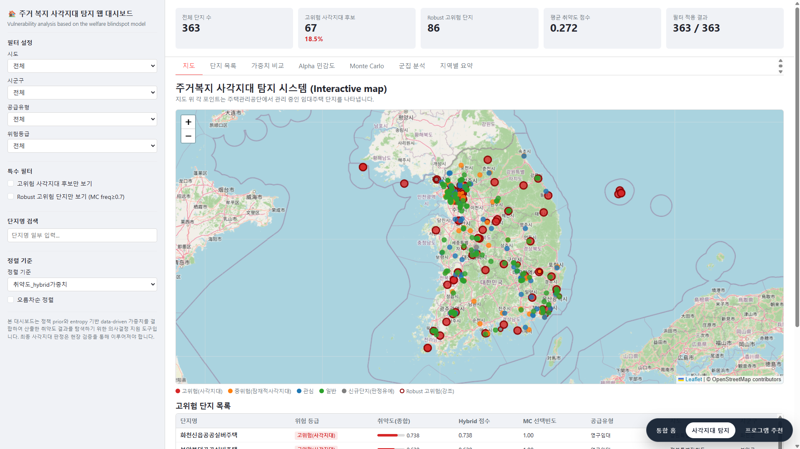
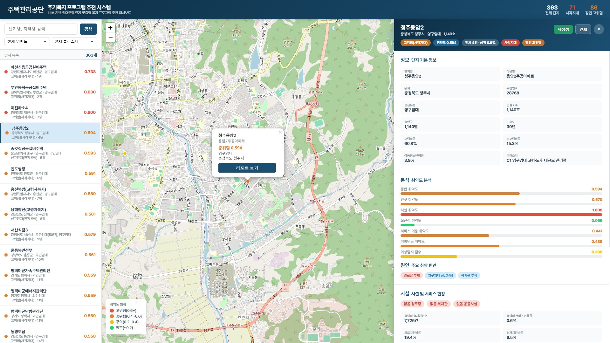

<div align="center">
<h6>The 5th AI and Public Data Utilization and Startup Competition</h6>

<h1>AI 기반 맞춤형 주거복지 지원 플랫폼</h1>

<div>    
    <a>박정준</a>&nbsp&nbsp&nbsp&nbsp;
    <a>김서현</a>
</div>
<br>
<div>
    경상국립대학교 AI정보공학과
</div>

<div>
    <h4 align="center">
        <a href="https://www.youtube.com/???????" target="_blank">
            
        </a>
        <a href="https://clustering-jun.github.io/Housing-welfare-system/" target="_blank">
            
    </h4>
</div>
</div>

---

## 결과
<div align="center">

|  |
|:--:| 
| **주거 복지 사각지대 탐지 대시보드** |

<br>

|  |
|:--:| 
| **복지 프로그램 추천 시스템** |


</div>

---

## 뉴스
- **2026년 04월 10일 ~ 04월 11일:** [부트 캠프] 선정 과제 및 수행 방향 발표
- **2026년 05월 08일:** 저장소 생성
- **2026년 05월 10일:** 최종 결과 보고서 제출
- **2026년 05월 14일:** 1차 서면평가 합격
- **2026년 05월 20일:** 최종 대면평가

---

## 프로젝트 구조

```text
├── analysis/                         # 모델링 및 분석 실행 스크립트
│   ├── welfare_blindspot.py          # 복지 사각지대 발굴 모델
│   └── cluster_analysis.py           # 군집별 연관 규칙 및 프로파일 분석
├── preprocessing/                    # 원천 데이터 전처리 스크립트
│   ├── build_base_complex.py         # 임대단지 기본 데이터 집계
│   ├── merge_soc_accessibility_layers.py
│   ├── join_complexes_with_soc.py
│   └── clean_community.py
├── scripts/                          # 실행/빌드 유틸리티
│   ├── build_blindspot_web_data.py   # 사각지대 대시보드 CSV 생성
│   ├── build_recsys_web_data.py      # 추천 시스템 JSON 생성
│   └── run_recsys_api.py             # 추천 API 서버 실행
├── src/rec_sys/                      # 추천 시스템 패키지
│   ├── api.py
│   ├── config.py
│   ├── data_loader.py
│   ├── recommender.py
│   ├── program_catalog.py
│   ├── community_retriever.py
│   ├── static_builder.py
│   └── server.py
├── data/                             # 데이터 자리표시자, 실제 데이터는 gitignore
│   ├── raw/
│   ├── interim/
│   ├── processed/
│   └── external/
├── outputs/                          # 분석 산출물, 실제 파일은 gitignore
├── cache/                            # LLM 캐시, 실제 파일은 gitignore
├── img/                              # GitHub 표시용 이미지 자리표시자
├── web/                              # GitHub Pages 정적 웹 원본
├── pyproject.toml
├── requirements.txt
└── .env.example
```

## 설치

Python 3.10 이상을 권장합니다.

```bash
pip install -r requirements.txt
pip install -e .
```

환경 변수 예시는 `.env.example`을 참고합니다. OpenAI API 키가 없어도 추천 시스템은 규칙 기반 fallback으로 동작합니다.

---
## 인용
본 연구(또는 코드)를 인용하실 경우, 아래와 같이 표기해 주시기 바랍니다.
```
박정준, 김서현, "AI 기반 맞춤형 주거복지 지원 플랫폼," 제5회 AI·공공데이터 활용 및 창업 경진대회, 2026.
```

## 감사의 글
함께 고민하고 노력해 준 팀원 김서현에게 감사의 마음을 전합니다.

본 연구·개발 프로젝트는 『제5회 AI·공공데이터 활용 및 창업 경진대회』의 일환으로 수행된 결과물입니다.

## 연락처
관련하여 궁금한 사항이 있으신 경우 아래로 연락해 주시기 바랍니다.
    
- 책임자: 박정준 ([LinkedIn](https://www.linkedin.com/in/jeong-jun-park/))
- 전자우편: [cluster@gnu.ac.kr](mailto:cluster@gnu.ac.kr)  

<br>

<div align="center">


</div>
